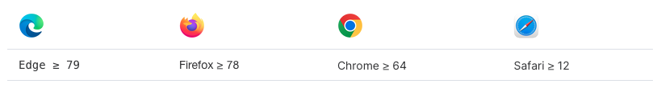

# 快速开始

## 安装

### 环境支持
dy-virtual-table 可以在支持 ES2018 和 ResizeObserver 的浏览器上运行。 如果您确实需要支持旧版本的浏览器，请自行添加 Babel 和相应的 Polyfill 。

由于 Vue 3 不再支持 IE11，Element Plus 也不再支持 IE 浏览器。



### 版本
dy-virtual-table 目前处于1.0.0版本，正在努力研发中。


#
我们建议您使用包管理器（如 NPM、Yarn 或 pnpm）安装 dy-virtual-table，然后您就可以使用打包工具，例如 Vite 或 webpack。
````node
# 选择一个你喜欢的包管理器

# NPM
$ npm install dy-virtual-table --save

# Yarn
$ yarn add dy-virtual-table

# pnpm
$ pnpm install dy-virtual-table

````
如果您的网络环境不好，建议使用相关镜像服务 cnpm 或 中国 NPM 镜像。


## 用法

### 完整引入

```ts{4}
import { createApp } from 'vue'
import App from './App.vue'

import DyVirtualTable from 'dy-virtual-table'
import 'dy-virtual-table/dist/style.css'

createApp(App).use(DyVirtualTable).mount('#app')
```
### Volar 支持
如果您使用 Volar，请在 tsconfig.json 中通过 compilerOptions.type 指定全局组件类型。

```json
// tsconfig.json
{
  "compilerOptions": {
    // ...
    "types": ["dy-virtual-table/global"]
  }
}
```